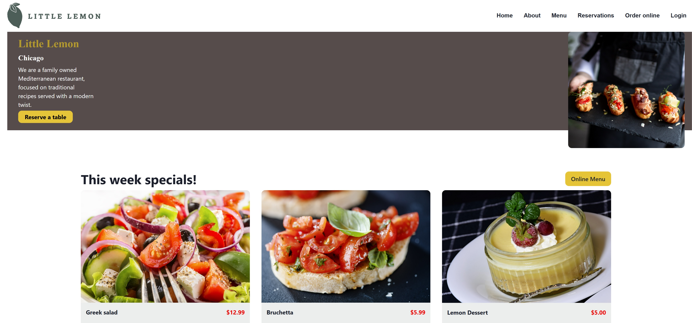
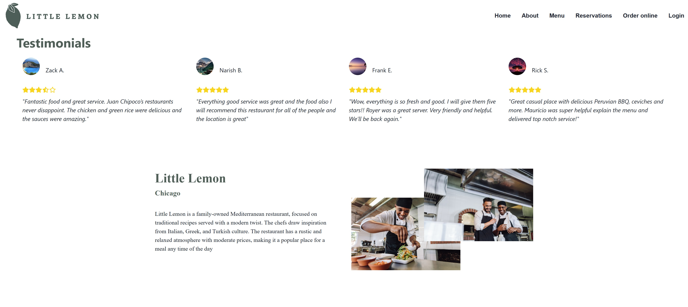
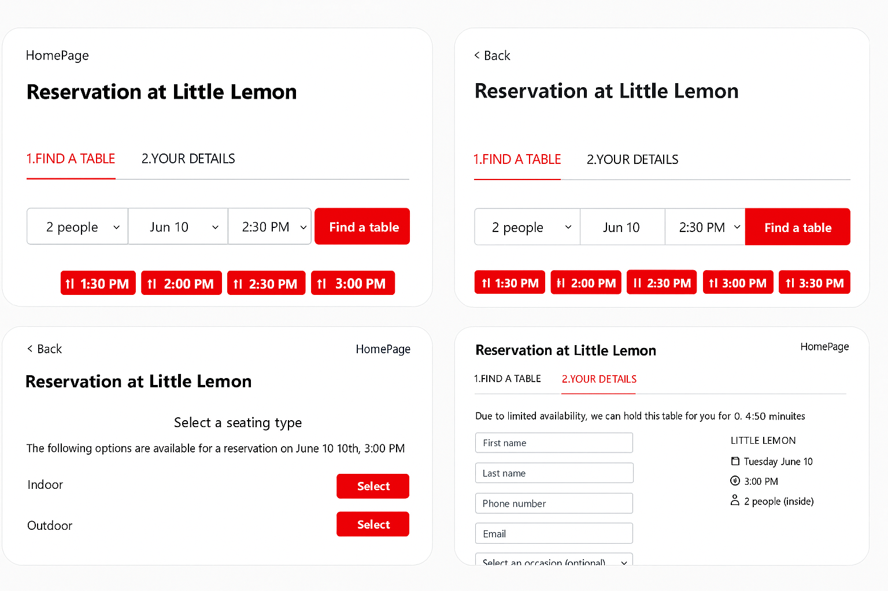

https://little-lemmon-yeinier.netlify.app/
## 🍽️ Little Lemon Restaurant App

A simple React-based frontend simulation of a restaurant website for Little Lemon, a Mediterranean-themed restaurant. The site features a reservation form, weekly specials, menu highlights, testimonials, and responsive layout for mobile and desktop.

## 📌 Description

This project simulates a full restaurant reservation and ordering experience using only the frontend. No external API is used; data is handled locally to mimic real-world behavior.

## ✨ Features

## 🏠 Home page with restaurant info and hero banner

## 🗓️ Reservation form with dynamic step-based UI

## 🧾 Menu highlights with weekly specials

## ⭐ Testimonials section

## 📱 Fully responsive layout (mobile and desktop)

## 🎨 Styled with custom CSS modules and clean component structure

## 🚀 Getting Started
```
git clone https://github.com/Yeinier22/Little-Lemon.git
cd little-lemon
npm install
npm start
```

The app will run on http://localhost:3000.

📁 Project Structure
```
/src
  ├── Components         # Reusable UI components
  ├── Styles             # CSS files
  ├── images             # Project assets
  ├── Test               # Reservation logic and subcomponents
  ├── App.js
  ├── HomePage.js
  └── index.js
```
🧪 Notes

The reservation steps and available times are simulated.

No backend/API connection is needed.

📷 Screenshots

Include screenshots showing:








📚 Credits

Design inspired by the Meta Front-End Capstone project (Coursera). All images used are for demo purposes only.
